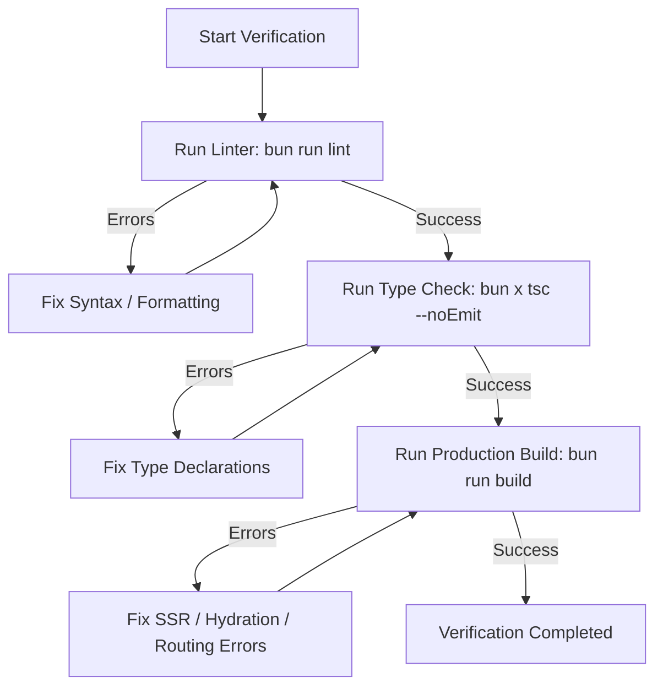

# Finance Mini App - AI Agent Automated Workflows (`.agent/workflows.md`)

> [!NOTE]
> This file contains the standard, step-by-step command sequences that AI agents can execute autonomously to set up, lint, type-check, and build the Finance Mini App. Follow these workflows verbatim to verify code changes before finalizing tasks.

---

## 1. Workflow: Dependency Management & Installation

Use this workflow to safely set up dependencies or resolve lockfile mismatch issues. Always use **Bun**.

### Commands Sequence
```bash
# 1. Clean install dependencies using lockfile
bun install --frozen-lockfile

# 2. If a new package needs to be added, run:
# bun install <package_name>
```

---

## 2. Workflow: Static Analysis & Code Quality Verification

Run this workflow after making modifications to ensure compliance with strict styling, syntax, and type-system conventions.

### Commands Sequence
```bash
# 1. Run ESLint checks (using project's eslint.config.mjs)
bun run lint

# 2. Verify TypeScript type safety without generating output files
bun x tsc --noEmit
```

---

## 3. Workflow: Production Build Verification

Always run this workflow before finalizing any feature or bug fix to guarantee that Next.js compilation works flawlessly and there are no hidden SSR / build errors.

### Commands Sequence
```bash
# 1. Trigger production Next.js compilation
bun run build

# 2. Verify that there are no server-side generation (static or dynamic) errors in the output log.
```

---

## 4. Workflow: Clean Workspace & Reset

If you encounter bizarre build errors, local caching issues, or bundler-related hiccups, execute this sequence to clean up build and dependency caches and start fresh.

### Commands Sequence
```bash
# 1. Remove build output and node_modules recursively
rm -rf .next node_modules tsconfig.tsbuildinfo

# 2. Re-install fresh dependencies
bun install

# 3. Re-run linter and check type safety
bun run lint && bun x tsc --noEmit
```

---

## 5. Standard Verification Workflow for Code Changes

Whenever you modify any code in this repository, you **MUST** execute the following checklist in sequence:



### Action Steps:
1. **Linter Validation**: `bun run lint`
2. **Type Safety Validation**: `bun x tsc --noEmit`
3. **Production Validation**: `bun run build`
4. If any step fails, rectify the issue immediately and start the verification sequence again from Step 1.
